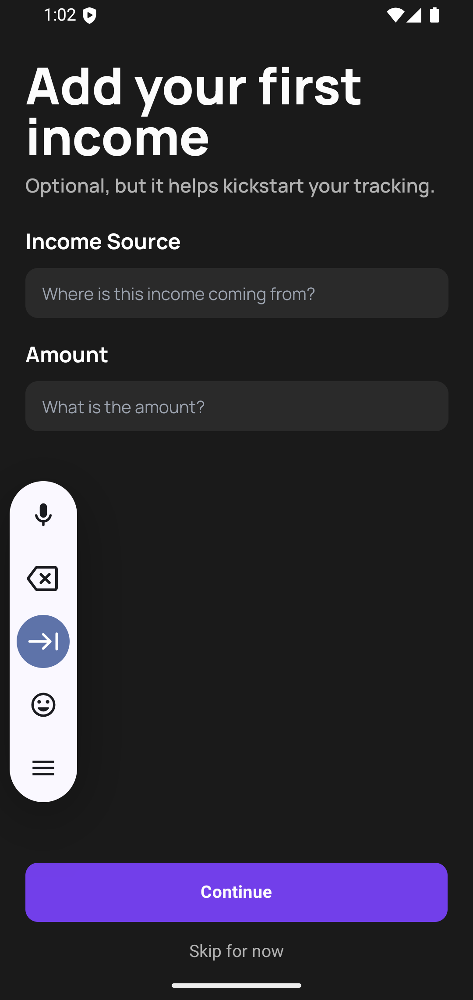

# Welcome to your Expo app 👋

A simple app to track your income and expenses. Built with Expo, NativeWind and WatermelonDB.

## WatermelonDB
This app uses WatermelonDB as its database. WatermelonDB is a high-performance reactive database for React and React Native. The reason why I chose WatermelonDB is because it is optimized for a large amount of data and it is also offline-first. It is also possible to sync the local data with your server. You can learn more about [WatermelonDB](https://watermelondb.dev/).

## Get started

1. Install dependencies

   ```bash
   bun install
   ```

2. Start the app

   ```bash
   bun run android
   ```


## Preview Build
If you want to try the app with your physical Android device, you need to build the app first
```bash
bun run preview
```

Then share the `.apk` file to your device and install it.

## Added New Features or Fix Bugs
If you added a new feature or fixed a bug, please update the `version` and `android.versionCode` (just increment them) in `app.json`. It works the same if you installed the app in your device and you want to update it.

## Screenshots
Here are some screenshots of the app:

### Boarding Screen
   

### Home Screen
  

Check all screenshots in the [screenshots](./screenshots) folder.

## Learn more

To learn more about developing your project with Expo, look at the following resources:

- [Expo documentation](https://docs.expo.dev/): Learn fundamentals, or go into advanced topics with our [guides](https://docs.expo.dev/guides).
- [Learn Expo tutorial](https://docs.expo.dev/tutorial/introduction/): Follow a step-by-step tutorial where you'll create a project that runs on Android, iOS, and the web.
To learn more about developing your project with Expo, look at the following resources:

- [Expo documentation](https://docs.expo.dev/): Learn fundamentals, or go into advanced topics with our [guides](https://docs.expo.dev/guides).
- [Learn Expo tutorial](https://docs.expo.dev/tutorial/introduction/): Follow a step-by-step tutorial where you'll create a project that runs on Android, iOS, and the web.
